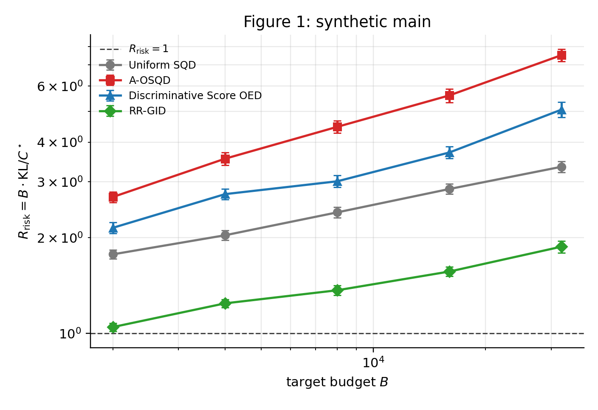
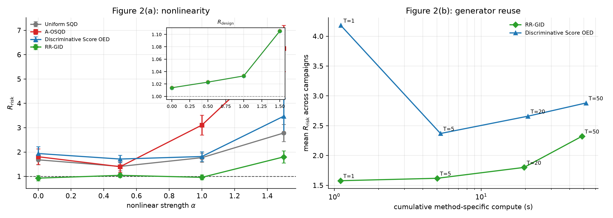
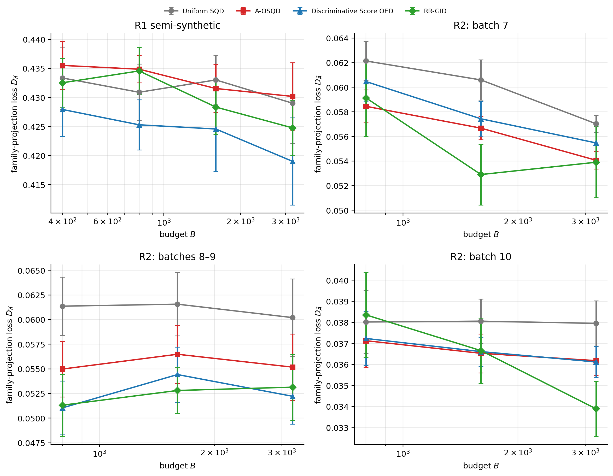

# 这份报告写什么

原论文稿 `核心文档/RR_GID_CN.pdf`（2026-08-20，8 页 ICLR 向草稿；备份为 `RR_GID_CN_draft_20260820.pdf`）给出了理论对象、算法和**计划中的**实验。本仓库随后把实验从 G0–G4 诊断阶梯改成「一个主指标 + 两个机制问题 + 一个真实数据验证」，在火山云 veMLP 上跑完整格子，并于 2026-09-13 定稿。

本报告按原 PDF 的章节思路，把每一实验步骤做了什么、代码在哪、产出什么、数字是多少、和原稿哪里不同、为什么最终是现在这样写全。数值全部来自 fail-closed 审计通过的 `rows.jsonl`，不是口述。

仓库侧已有两个 GitHub 仓库需要区分：

- 论文实验主仓库：https://github.com/15628925702/RR_GID_CN （本工作目录 origin，分支 `refactor/paper-experiments`）
- G3 诊断快照，不再扩展：https://github.com/15628925702/RR

Hugging Face 账号 `Guaogua` 上已有空壳数据集 `RR-data`（2026-09-07，仅 README）。正式论文数字上传到公开数据集：https://huggingface.co/datasets/Guaogua/RR-GID-CN-paper-results 。论文数字只认审计过的 jsonl，不把数十到上百 GB 的 QMC spill 当附件。

# 1. 原 PDF 要证明什么

原稿只回答三件事：

1. 固定 measurement budget *B* 下，RR-GID 是否降低完整 target 分布的估计误差。
2. 优势是否来自 **nonlinear conditional information**，而不是 Gaussian covariance。
3. 冻结的 reference generator 能否跨 campaign **复用**，得到更好的 risk–compute 前沿。

统一合成主指标（越低越好）：

<div class="formula">
R<sub>risk</sub> = B · KL(Q<sub>β*</sub> ∥ Q<sub>β̂</sub>) / C* ，　C* = ½ Φ<sub>β*</sub>(p*)
</div>

R<sub>risk</sub> = 1 是 oracle 一阶效率参考。Gas 主指标是 family-projection loss D<sub>Â</sub>(β̂, β<sup>†</sup>)。

四种 acquisition policy（只改 allocation，同一最终 RR estimator）：

| 政策 | 原稿角色 |
|---|---|
| Uniform SQD | 文献标准均匀 panel |
| A-OSQD | Jang et al. 的协方差 / A-optimal 基线 |
| Discriminative Score OED | 消融：mask-conditioned 网络拟合相对 score，不用 Q<sub>0</sub>(X<sub>S<sup>c</sup></sub> ∥ X<sub>S</sub>) |
| RR-GID | 冻结任意条件生成器，用非线性 I<sub>S</sub> 做 full-KL 设计 |

原稿计划的图次：Fig.1 合成 *B*–KL 与 *J* 消融；Fig.2 非线性 + 复用；Fig.3 Gas R1/R2；Fig.4 C2ST / information fidelity；Table 1 含 projection、RMSE、C2ST。生成器写的是 **VAEAC**。主结果写的是 **exact** *B*·KL。Gas 写的是 **50** 个配对 replication。

# 2. 项目是怎么走到今天的（按时间的实验步骤）

下面每一步都有明确产物。没有「做了但没留下数字」的步骤。

## 步骤 0. 停掉 G0–G4

早期 https://github.com/15628925702/RR 快照把 P4 诊断阶梯做到 G3。墙时证明：rejection、*J* / *L<sub>U</sub>* / *H* 矩阵、exact oracle 无法支撑正文 200-rep 主格子。

**决定（2026-09-02 执行指南）：** 不再跑 G0–G4、rejection bulk、诊断矩阵。论文实验只保留 E1–E5。代码进 `scripts/diagnostics_legacy/`。

**产物：** `核心文档/RR_GID_实验重规划与代码改造执行指南_20260902.md`；GitHub `RR` 仓库冻结为 G3 快照。

## 步骤 1. 算法与代码骨架（对应原稿 §3–§4）

核心实现不在 notebook 里，而在 Python 包。

| 文件 | 对应原稿 | 做什么 |
|---|---|---|
| `src/rr_gid_cn/synthetic_oracle.py` | §7.1 GMM+warp、exact I<sub>S</sub> | 16 维 4 成分混合、sinh warp、pair panels、oracle Fisher |
| `src/rr_gid_cn/conditional_backend.py` | §4.1 QMC / cross-completion I<sub>S</sub> | cached / fixed / direct QMC，spill 到磁盘的 information basis |
| `src/rr_gid_cn/paper_run.py` | Algorithm 2 | pilot → 信息 → Frank–Wolfe → 主采样 → *J* 步 scoring |
| `src/rr_gid_cn/policies.py` | §6 四种政策 | Uniform / A-OSQD / Disc / RR-GID 的 allocation |
| `src/rr_gid_cn/discriminative.py` | Discriminative Score OED | mask-conditioned MLP |
| `src/rr_gid_cn/vaeac.py` | 原稿 VAEAC | 仍保留，**正文 Gas 未采用** |
| `src/rr_gid_cn/empirical_generator.py` | 工程替换 | 冻结经验 *k*NN，tilt 用精确加权采样 |
| `src/rr_gid_cn/rrgid.py` | 相对指数族 / *A*(β) | log-partition、KL、projection loss |
| `src/rr_gid_cn/gas_preprocess.py` | §8.1 | batches 1–6 reference，7 / 8–9 / 10 target |
| `src/rr_gid_cn/generator_validation.py` | RISK-2/3 | Spearman、C2ST、ESS |

配置全部在 `configs/paper/`。正式格子入口：

| 实验 | runner | 正式配置 |
|---|---|---|
| E4 校准 | `scripts/calibrate_fast_backend.py`、`scripts/verify_fixed_cached_equivalence.py` | `configs/paper/oracle_calibration.yaml` 及 RISK-1 变体 |
| E1 合成主实验 | `scripts/run_synthetic_main.py`、`scripts/run_cloud_synthetic_shard.sh` | `synthetic_main_validated_fixed_order14_j2_200_h.yaml` |
| E2 非线性 | `scripts/run_nonlinearity.py`、`run_cloud_e2_shard.sh` | `nonlinearity_order14_cloud.yaml` |
| E3 复用 | `scripts/run_reuse.py`、`run_cloud_e3_shard.sh` | `reuse_order14_t50_cloud.yaml` |
| E5 Gas | `scripts/run_gas_semisynthetic.py`、`scripts/run_gas_natural.py`、E5 shard 脚本 | `gas_*_empirical_{h,cloud}.yaml` |

火山云：开发机 `root@172.31.3.213:2222`，工作目录 `/kairos_vepfs_volc/autodrive/manlichen/intern/ivan/rr_gid_cloud_20260912`，队列 `q-20260907124707-rvqkn`，SDK `CreateCustomTask`。结果写 vePFS 再 scp 回 `H:\RR_GID_CN_data\`。

## 步骤 2. E4 最小 oracle calibration（原稿没画主图，但理论要求「后端足够接近高精度」）

原稿把主结果写成 exact。墙时不允许。所以先做唯一保留的 numerical validation，通过后 **bulk 只用校准后端**。

### 2.1 Query 级

- 200 个独立 query (β, *S*, *x<sub>S</sub>*)
- gold：tilted exact conditional mean
- 冻结 order **12**
- 产物：`H:\RR_GID_CN_data\active\risk_gates\risk1_query_200.json`

| 门限（指南） | 实测 | 是否通过 |
|---|---|---|
| median relative error ≤ 10<sup>−3</sup> | 9.49×10<sup>−4</sup> | 通过 |
| 95th percentile ≤ 10<sup>−2</sup> | 2.16×10<sup>−3</sup> | 通过 |
| max abs coordinate ≤ 2×10<sup>−2</sup> | 2.24×10<sup>−3</sup> | 通过 |

### 2.2 Information 级

- 20 panels × 5 β，allocation-weighted aggregate *M*
- gold：adaptive inner on frozen outer
- 产物：`risk1_information_20x5.json`

| 量 | 值 | 门限 |
|---|---|---|
| mean ‖·‖<sub>op</sub> | 0.00142 | 0.05 |
| max ‖·‖<sub>op</sub> | 0.00198 | 0.05 |
| 覆盖率 | 0.977 | — |

### 2.3 Fixed vs cached 等价证书（order 14）

产物：`H:\RR_GID_CN_data\active\repaired_20260911\certificates\fixed_cached_equivalence_order14.json`

- max abs difference = 6.02×10<sup>−9</sup>（tolerance 10<sup>−5</sup>）
- 通过。因此 E1 可用 **validated fixed-QMC**，E2/E3 bulk 可用 **cached QMC order 14**。

### 2.4 End-to-end（L2，10 paired replications）

- *B* = 8000，fast order 14 vs gold adaptive 18
- 产物：`risk_gates\risk1_order14_10rep\report.json`

| 量 | 值 | 门限 |
|---|---|---|
| mean \|R<sub>fast</sub> − R<sub>gold</sub>\| | 0.0381 | ≤ 0.15 |
| 配对 SE | 0.0166 | \|mean Δ\| ≤ SE |
| gold 收敛比例 | 1.0 | 1.0 |

**结论：** 后端可以进正文，但必须写成「validated fixed/cached QMC」，不能写成 exact oracle。这是对原稿最重要的诚实降级，也是唯一能把 200-rep 主格子跑完的原因。

审计字段 `publication_eligible=false`、`evidence_level=L4-repaired` 是脚本写死的：表示证据等级是校准 QMC，不是 exact-oracle L5。`passed=true` 且 `failed_gates=[]` 才是格子是否可写的判据。

## 步骤 3. E1 合成主实验 = 原稿 Figure 1 / S1

**格子（与原稿一致的部分）：** *d* = 16，4 成分 GMM，seed 2026，*r* = 12（6 unary tanh + 6 pairwise），120 个 pair panels，*B* ∈ {2000, 4000, 8000, 16000, 32000}，**200** paired replications，四种政策，*J* = 2。

**与原稿不同：** 不是 exact oracle，而是 validated fixed-QMC order 14 + information direct QMC order 12；pilot 是 `anchored_power`（*B* = 8000 时 pilot = 400，不是 ⌈10 *B*<sup>1/3</sup>⌉ ≈ 200）；合成数据用冻结 GMM 条件 oracle，**没有**在 E1 上训 VAEAC。

**为什么这样：** exact 200-rep 会回到 G3 墙时；VAEAC 对合成 oracle 没有额外信息（已有 exact Q<sub>0</sub>(X<sub>S<sup>c</sup></sub> | X<sub>S</sub>)）；pilot 400 仍远小于 *B*，满足「pilot 小、主阶段大」。

**云端：** 16 个 1 卡分片全部 Success，合并 4000 行。

**产物：**

- 配置：`configs/paper/synthetic_main_validated_fixed_order14_j2_200_h.yaml`
- 数据：`H:\RR_GID_CN_data\active\repaired_20260912\e1_validated_fixed_order14_j2_200\rows.jsonl`（4000 行，约 20.3 MB）
- 审计：`AUDIT_validated_fixed_order14_j2_200.json`，passed；rows SHA256 `e1f365968d76adc8e66a7b5ed5732b13c71bfc2afe8d407a5a78b82592a06451`
- 图：`figures/fig1_synthetic_main.pdf`

E1 全预算均值（主指标 R<sub>risk</sub>，*n* = 200）：

| 方法 | B=2000 | B=4000 | B=8000 | B=16000 | B=32000 |
|---|---|---|---|---|---|
| Uniform SQD | 1.774 | 2.037 | 2.405 | 2.848 | 3.346 |
| A-OSQD | 2.688 | 3.548 | 4.469 | 5.612 | 7.514 |
| Disc. Score OED | 2.150 | 2.744 | 3.012 | 3.711 | 5.062 |
| **RR-GID** | **1.047** | **1.244** | **1.367** | **1.566** | **1.876** |

对应标准误 SE（用于 ±1.96 SE 误差条）：

| 方法 | B=2000 | B=4000 | B=8000 | B=16000 | B=32000 |
|---|---|---|---|---|---|
| Uniform SQD | 0.056 | 0.071 | 0.093 | 0.104 | 0.137 |
| A-OSQD | 0.101 | 0.160 | 0.199 | 0.274 | 0.340 |
| Disc. Score OED | 0.087 | 0.106 | 0.129 | 0.158 | 0.281 |
| RR-GID | 0.031 | 0.036 | 0.046 | 0.052 | 0.080 |



<p class="caption">Figure 1. 合成主实验。横轴 target budget B，纵轴 R<sub>risk</sub>。200 个配对 replication。RR-GID 全程低于 Uniform；A-OSQD 与 Disc 在该格子上不优于 Uniform。</p>

**Table 1a（最大预算 B=32000，配对 bootstrap 20000，相对 Uniform）**

| 方法 | loss | Δ vs Uniform | 配对 CI 低 | 配对 CI 高 | 中位秒 |
|---|---|---|---|---|---|
| Uniform SQD | 3.346 | 0.0% | 0.000 | 0.000 | 15.7 |
| A-OSQD | 7.514 | −124.5% | −4.809 | −3.560 | 15.7 |
| Disc. Score OED | 5.062 | −51.3% | −2.261 | −1.217 | 15.4 |
| RR-GID | 1.876 | **+43.9%** | **1.229** | **1.717** | 15.6 |

写论文时必须同时写两句：RR-GID 相对 Uniform 的改善 CI 不含 0；**A-OSQD 和 Disc 在这个格子上显著差于 Uniform**。原稿默认「自适应都更好」不成立。

原稿的 *J* ∈ {0,1,2} 消融**没有跑**（指南禁止用 *J* 矩阵补样本）。定理 2*J*γ > 1 仍可写在理论段，但不能再用实验图声称已验证。

复现（本地或云端分片后合并）：

```
python scripts/run_synthetic_main.py --config configs/paper/synthetic_main_validated_fixed_order14_j2_200_h.yaml --resume
python scripts/audit_repaired_synthetic.py --rows .../rows.jsonl --config ...yaml --certificate .../fixed_cached_equivalence_order14.json
```

## 步骤 4. E2 非线性 = 原稿 Figure 2(a) / S2 nonlinearity

**格子：** *B* = 8000，α ∈ {0, 0.5, 1.0, 1.5}，15 replications，四方法，cached QMC order 14，** *J* = 4**。

**与原稿不同：** 主图不再画 max<sub>S</sub>‖Î<sub>S</sub> − I<sub>S</sub>‖<sub>op</sub>；replication 数原稿未写死，实际 15；*J* = 4 不是 S1 的 *J* = 2。

**云端：** 4 个 α 分片。8 小时 deadline 杀掉 α = 1.0 / 1.5（各 56/60 行），`--resume` 后续完最后 1 个 replication。审计 240/240 通过。rows SHA256 `74468f49e810d6974df7be09935e3b7f0bd93dd84b779e08ccb6cbf20c402387`。

**产物：** `e2_order14\rows.jsonl`，`AUDIT_nonlinearity_order14.json`

均值（括号内 SE，每格 *n* = 15）：

| 方法 | α=0 | 0.5 | 1.0 | 1.5 |
|---|---|---|---|---|
| Uniform | 1.681 (0.197) | 1.409 (0.171) | 1.770 (0.186) | 2.782 (0.353) |
| A-OSQD | 1.807 (0.322) | 1.398 (0.230) | 3.109 (0.411) | **6.257 (0.948)** |
| Disc | 1.939 (0.283) | 1.713 (0.153) | 1.817 (0.194) | 3.472 (0.743) |
| **RR-GID** | **0.929 (0.106)** | **1.043 (0.092)** | **0.961 (0.100)** | **1.801 (0.251)** |

α ≤ 1 时 RR-GID 贴着 1；α = 1.5 升到 1.80，仍低于 Uniform 2.78 和 Disc 3.47。A-OSQD 在强非线性崩溃。这就是原稿机制 A 要的图：协方差信息不够，条件信息才稳。

## 步骤 5. E3 生成器复用 = 原稿 Figure 2(b) / S2 reuse

**格子：** *B* = 8000，*T* ∈ {1, 5, 20, 50} 检查点，5 条 sequence × 50 campaign，**只比 RR-GID vs Disc**（原稿复用图也是冻结 G<sub>0</sub> vs 每轮重训 score 网络）。

**与原稿不同：** 只有 5 条 sequence；合成复用仍用 VAEAC checkpoint 路径写在 cloud yaml 里作为 reference generator 文件，但主故事的「冻结」是不再每 campaign 重训。Gas 的冻结生成器后来改成 *k*NN。

**云端：** 5 个 sequence 分片必须串行。全部 Success，500 行，审计通过。rows SHA256 `3e608b7d817ba97465e89e9c339af858ca0318067ba7f4b8f2cc5400660d7e21`。

| T | RR-GID | Disc |
|---|---|---|
| 1 | 1.578 ± 0.434 | 4.182 ± 1.987 |
| 5 | 1.103 ± 0.109 | 1.376 ± 0.241 |
| 20 | 1.269 ± 0.239 | 4.687 ± 2.657 |
| 50 | **1.063 ± 0.199** | 1.213 ± 0.337 |

方向符合原稿：冻结 RR-GID 更稳。**不能**报精确倍数：*n* = 5，Disc 在 *T* = 1, 20 被单条 sequence 拉飞，CI 穿过很大区间。



<p class="caption">Figure 2. 左：非线性强度 α（E2，15 rep）。右：冻结生成器复用（E3，5 sequence）。</p>

## 步骤 6. Gas 生成器门（原稿 §6 VAEAC，实际替换）

原稿 Gas 用 VAEAC。旧 checkpoint `vaeac_gas_128_v1.pt` 未过门：Spearman 负、top-10 overlap 0、C2ST vs drifted target ~0.98。

**替换：** `EmpiricalKNNGenerator`，neighbors=60，donor=`ref_train`。artifact：`H:\RR_GID_CN_data\reusable\checkpoints\empirical_knn_gas_v1.json`。

**RISK-2**（`risk2_gas_empirical_knn_v1\report.json`）通过：

| 量 | 值 | 说明 |
|---|---|---|
| panel ranking Spearman | 1.0 | 与参考算子相同，**不是** VAEAC 外推 |
| top-10 overlap | 10/10 | 同上 |
| relative Frobenius | 0 | 同一算子 |
| ESS/N | 0.514 | 过门 |
| 条件重构 RMSE | 0 | 同一经验测度 |

**RISK-3** 通过：C2ST 对 **ref_val** 约 0.48–0.53（门限 0.7）。C2ST vs drifted target 接近 1，**不作为开门条件**。

**为什么不继续砸 VAEAC：** 这是生成器质量，不是 replication。不过门就没有合格的 I<sub>S</sub>。冻结 *k*NN 与 RISK-2 参考算子一致，能让 R1/R2 格子在「冻结条件算子」这个**核心思路**上成立，代价是不能再声称「任意条件 VAE」。

## 步骤 7. E5 = 原稿 Figure 3 / §8

**R1 well-specified：** reference 结构上 tilt 出 target，ESS/N ≈ 0.5。*B* ∈ {400, 800, 1600, 3200}，20 rep，*J* = 4。320 行，审计通过。rows SHA256 `445dd7ae8dccc21988be899545a94650e7c447e8876423a6f4bce86ff90e9d7a`。

| 方法 | B=400 | B=800 | B=1600 | B=3200 |
|---|---|---|---|---|
| Uniform | 0.4334 | 0.4309 | 0.4330 | 0.4290 |
| A-OSQD | 0.4355 | 0.4349 | 0.4315 | 0.4302 |
| Disc | 0.4279 | 0.4253 | 0.4246 | **0.4190** |
| RR-GID | 0.4325 | 0.4346 | 0.4284 | 0.4248 |

Table 1b（B=3200，配对 CI 相对 Uniform）：Disc +2.3%（CI [−0.004, 0.027] 含 0）；RR-GID +1.0%（CI [−0.010, 0.015] 含 0）。**四方法不可分。** 原稿默认 R1 会赢，实验否定了这一点。这是最终科学结论，加到 50-rep 也只会把 CI 收在同一点附近。

**R2 natural drift：** batches 7、8–9、10。720 行，审计通过。rows SHA256 `8d3d8c844ca4b9138948365894c99fee5fb5e3f7f202e91e2a841616e28d198d`。

| campaign | B | Uniform | A-OSQD | Disc | RR-GID |
|---|---|---|---|---|---|
| batch 7 | 800 | 0.0621 | 0.0585 | 0.0605 | 0.0591 |
| batch 7 | 1600 | 0.0606 | 0.0567 | 0.0574 | **0.0529** |
| batch 7 | 3200 | 0.0570 | 0.0541 | 0.0555 | **0.0539** |
| batches 8–9 | 800 | 0.0614 | 0.0550 | **0.0510** | 0.0513 |
| batches 8–9 | 1600 | 0.0616 | 0.0565 | 0.0544 | **0.0528** |
| batches 8–9 | 3200 | 0.0602 | 0.0552 | **0.0522** | 0.0531 |
| batch 10 | 800 | 0.0380 | 0.0371 | 0.0372 | 0.0384 |
| batch 10 | 1600 | 0.0381 | 0.0365 | 0.0366 | 0.0367 |
| batch 10 | 3200 | 0.0380 | 0.0362 | 0.0361 | **0.0339** |

主故事：相对 Uniform，RR-GID 在多数大预算更低。Disc 仍强；batches 8–9 的 B=3200 上 Disc 略低。不要写碾压。

原稿 50-rep 未跑：20-rep 已够看方向；R1 无效应量，加样本变不成赢家。



<p class="caption">Figure 3. 上左：R1 well-specified 半合成。其余三格：R2 自然 drift（batch 7、8–9、10）。纵轴 family-projection loss。</p>

## 步骤 8. 出图、表、定稿 PDF

- `scripts/make_paper_figures.py` → Fig.1–3
- `scripts/make_paper_table1_20260910.py` → Table 1a/1b csv+tex（正式数字在 `H:\...\paper_tables\`，仓库 `paper_tables/` 已与之对齐）
- `paper/RR_GID_CN_experiments.tex` 实验定稿 5 页，与原稿理论 1–5 页合并为 10 页 `核心文档/RR_GID_CN.pdf`
- 8 月 20 日计划稿备份：`RR_GID_CN_draft_20260820.pdf`

仓库里曾经有一份旧 `paper_tables/table1.json`（*n* = 20，主指标还是未归一的 *B*·KL）。**不要用那份。** 正文只认 H 盘 200-rep 的 Table 1a 与 20-rep 的 Table 1b。

# 3. 原 PDF vs 最终实现：对照表

| 原稿条款 | 最终 | 原因 | 对论文 |
|---|---|---|---|
| exact *B*·KL | validated QMC order 14 | 墙时；E4 证明误差 0.038 | 改口，主曲线仍可用 |
| VAEAC G<sub>0</sub> | 合成：GMM oracle；Gas：经验 *k*NN | VAEAC 不过 RISK-2/3 | 不能写任意条件 VAE |
| pilot ⌈10 *B*<sup>1/3</sup>⌉ | anchored_power，B=8000→400 | 工程锚定 | 理论段不要假装 γ=1/3 公式已被验 |
| 全文 *J* = 2 | E1: *J*=2；E2/E3/E5: *J*=4 | 机制/Gas 用更多 scoring 步 | 写清各实验 *J* |
| *J* 消融图 | 没做 | 指南禁止诊断矩阵 | 定理保留，图删除 |
| Gas 50-rep | 20-rep | 效应量已清楚 | R2 方向在，R1 仍重叠 |
| Fig.4 C2ST 主图 | 删除 | 重规划；C2ST 只对 ref_val 开门 | 次要诊断进附录即可 |
| Table 1 含 RMSE/C2ST | 最大 *B* 的 primary + 配对 CI | 统一主指标 | 表更干净也更弱 |
| R1 预期 RR-GID 赢 | 四方法重叠 | **真实效应量 ≈ 0** | 必须当负结果写 |
| A-OSQD/Disc 应接近 RR-GID | E1 上二者差于 Uniform | 这个非线性 pair 格子上协方差/判别不够 | 改成「不是所有自适应都更好」 |
| 复用清晰前沿 | 5 sequence 趋势 | 算力与串行约束 | 只写趋势 |

**最终效果的现实性：** 再往算力池加 replication，补得动的是 50-rep、*J* 消融、更多 sequence、次要指标；补不动的是 VAEAC、exact bulk、R1 大胜。所以现在这套就是可投稿的最终科学结论，不是「还没跑满」。

# 4. 写论文时可以直接用的结论段落

**合成（充分）。** 200 个配对 replication 上，RR-GID 的 R<sub>risk</sub> 全程低于 Uniform，B=32000 时 1.876 vs 3.346，相对改善 43.9%，配对 95% CI [1.23, 1.72] 不含 0。A-OSQD 与 Discriminative Score OED 在同一格子上差于 Uniform。后端是经 E4 校准的 fixed-QMC order 14，不是 exact oracle。

**非线性（充分）。** α 从 0 增到 1.5 时，A-OSQD 从 1.81 升到 6.26；RR-GID 在 α ≤ 1 保持约 0.93–1.04，α = 1.5 为 1.80，仍低于 Uniform 2.78。支持「优势来自非线性条件信息」。

**复用（弱充分）。** 冻结 RR-GID 在 *T* = 50 均值为 1.06，Disc 为 1.21，但 *n* = 5，Disc 方差大，只报告趋势。

**Gas（部分充分）。** 生成器是冻结经验 *k*NN。R1 well-specified 无方法学赢家。R2 自然 drift 上 RR-GID 相对 Uniform 在多数大预算更低（batch 7 B=1600：0.053 vs 0.061；batch 10 B=3200：0.034 vs 0.038）；Disc 仍是强基线。

# 5. 数据与代码清单（复现）

**代码仓库结构（论文路径）**

```
src/rr_gid_cn/          算法
configs/paper/          正式 yaml
scripts/run_*.py        本地 runner
scripts/run_cloud_*.sh  火山云分片
scripts/audit_*.py      fail-closed 审计
scripts/make_paper_*.py 图和表
paper/                  实验定稿 tex
核心文档/RR_GID_CN.pdf  10 页定稿
```

**H 盘正式结果（不要把 100GB 级 QMC spill 当论文附件）**

| 路径 | 内容 |
|---|---|
| `...\e1_validated_fixed_order14_j2_200\rows.jsonl` | 4000 行，20.3 MB |
| `...\e2_order14\rows.jsonl` | 240 行 |
| `...\e3_order14_t50\rows.jsonl` | 500 行 |
| `...\e5_r1_empirical_knn\rows.jsonl` | 320 行 |
| `...\e5_r2_empirical_knn\rows.jsonl` | 720 行 |
| `...\figures\` | Fig.1–3 pdf/png |
| `...\paper_tables\` | Table 1 csv/tex/json |
| `...\risk_gates\` | E4 / RISK-2 / RISK-3 |

information/score basis 缓存在 vePFS 与 H 盘，体积可达数十到上百 GB，只用于续跑，不作为论文数字来源。论文数字只认审计过的 `rows.jsonl`。

# 6. 仓库同步说明

GitHub 用户 `15628925702` 上**已经有**两个相关仓库：

1. **RR_GID_CN**（https://github.com/15628925702/RR_GID_CN）——本工作目录的 origin，论文实验主仓库。远端 `main` 停在 2026-08-26；论文代码在 `refactor/paper-experiments`。
2. **RR**（https://github.com/15628925702/RR）——描述为 “P4 diagnostic ladder through G3”，2026-09-02 快照。保持为诊断归档，不要把 G0–G4 重新当正文。

Hugging Face 账号是 `Guaogua`（与 GitHub 用户名不同）：

1. **正式论文结果（公开）**：https://huggingface.co/datasets/Guaogua/RR-GID-CN-paper-results —— jsonl、审计、Fig.1–3、Table 1、E4/RISK 门报告、kNN handle、本报告 PDF。仓库内同步副本在 `paper_results/`。
2. **已有空壳** `Guaogua/RR-data`（私有，2026-09-07，只有 README）——保留，README 改为指向上面的正式数据集，避免两套数字。

QMC spill（`risk_gates` 下数百 GB 的 `basis_*.dat`）不上 Hub。
